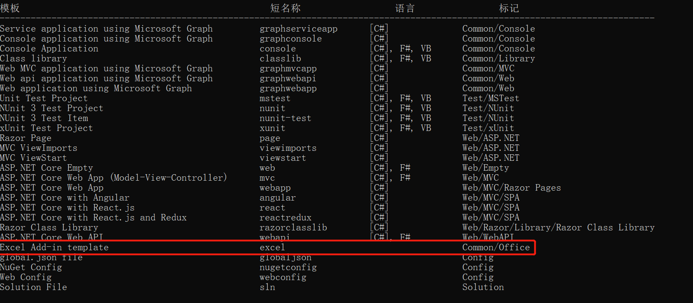
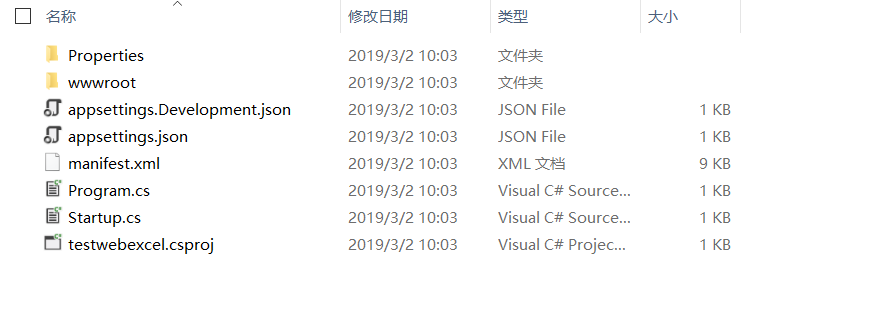
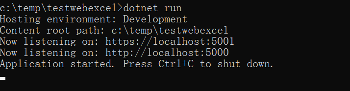
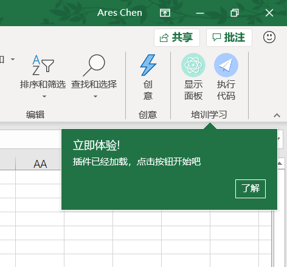
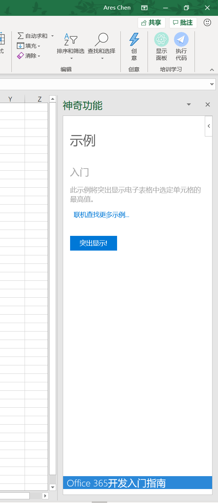
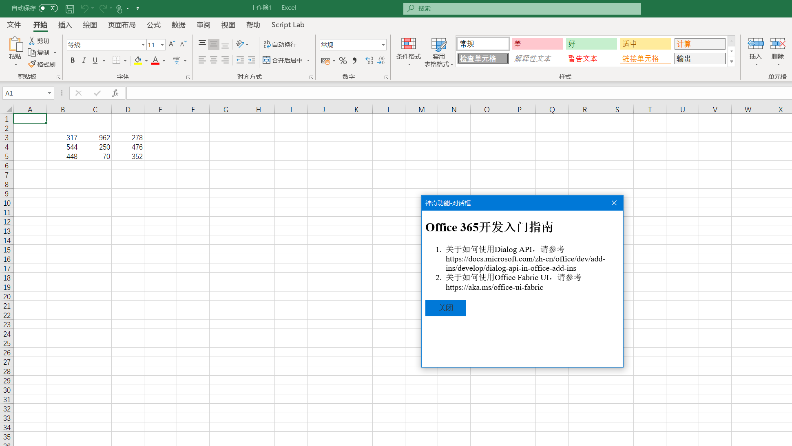

# Office Add-in Template - Excel

> Ares Chen @ 2019-3-2

## How to install

You can run the command `dotnet new -i chenxizhang.dotnetcore.officeaddin.excel` to install the template, please confirm the template list as below.

## Create the project

You can create a new add-in project via `dotnet new excel -o youraddinname`

## Run the project

If this is your first time to run a Office add-in project, you may need to run this command `dotnet dev-certs https -t` to install a local certificate and trust it. then you can switch to the project directory, and just hit  `dotnet run`, your add-in will running on 5000 and 5001 port.

## Sideload the add-in

You have several ways to sideload the add-in in your environment, please read this article <https://docs.microsoft.com/zh-cn/office/dev/add-ins/testing/create-a-network-shared-folder-catalog-for-task-pane-and-content-add-ins>.

And now your even have a easy way to do this, you can install a tool `office-toolbox` to save your time and have fun. please find the more detail information at <https://github.com/chenxizhang/dotnetcore-office365dev-templates-officeaddin/tree/master/dotnetcore-officeaddin-toolbox>

## 中文说明

> 作者：陈希章 于 2019-3-2

## 模板安装

请通过 `dotnet new -i chenxizhang.dotnetcore.officeaddin.excel` 这个命令来安装该模板。请确认你安装后看到如下的模板。

## 创建项目

请通过 `dotnet new excel -o youraddinname` 来创建项目。正常情况下，该命令很快就会返回 “已成功创建模板“Excel Add-in template”” 的字样，而且你会看到有一个目录。

## 运行项目

如果你需要在本地调试，请先运行 `dotnet dev-certs https -t`创建并安装一个本地的证书。然后请切换到该目录，然后运行 `dotnet run`即可，正常情况下会看到如下的提示，该网站将在5000和5001端口分别监听。

## 在Excel中加载Add-in

请参考<https://docs.microsoft.com/zh-cn/office/dev/add-ins/testing/create-a-network-shared-folder-catalog-for-task-pane-and-content-add-ins> 这里的说明，将项目根目录下面的manifest.xml文件复制到一个共享目录，然后通过Sideload的方式进行加载。

添加以上插件后，在Excel中看到的效果如下

如果点击“显示面板”按钮，则会出现下面的效果

如果点击“执行代码”按钮，则会出现下面的效果

> 这套模板是《Office 365开发入门指南》的开源代码一部分，如果有兴趣了解该书，或者配套视角教程，请参考 <https://github.com/chenxizhang/office365dev>

你现在有一种更加简单的方式来实现旁加载，请参考我发布的新工具 <https://github.com/chenxizhang/dotnetcore-office365dev-templates-officeaddin/tree/master/dotnetcore-officeaddin-toolbox>