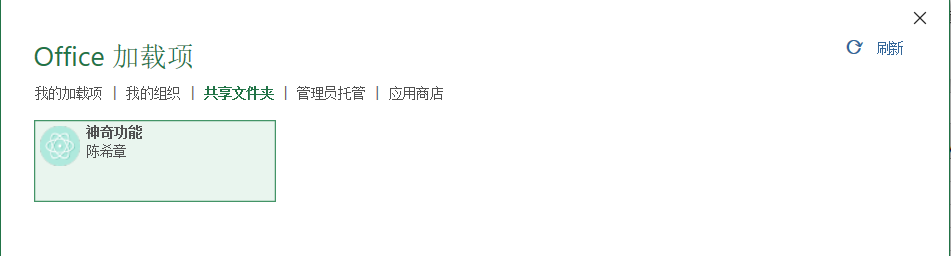

# Office Add-in 模板 - Excel

> 作者：陈希章 于 2019-3-2

## 模板安装

请通过 `dotnet new -i chenxizhang.dotnetcore.officeaddin.excel` 这个命令来安装该模板。请确认你安装后看到如下的模板。

## 创建项目

请通过 `dotnet new excel -o youraddinname` 来创建项目。正常情况下，该命令很快就会返回 “已成功创建模板“Excel Add-in template”” 的字样，而且你会看到有一个目录。

## 运行项目

如果你需要在本地调试，请先运行 `dotnet dev-certs https -t`创建并安装一个本地的证书。然后请切换到该目录，然后运行 `dotnet run`即可，正常情况下会看到如下的提示，该网站将在5000和5001端口分别监听。

## 在Excel中加载Add-in

请参考<https://docs.microsoft.com/zh-cn/office/dev/add-ins/testing/create-a-network-shared-folder-catalog-for-task-pane-and-content-add-ins> 这里的说明，将项目根目录下面的manifest.xml文件复制到一个共享目录，然后通过Sideload的方式进行加载。

添加以上插件后，在Excel中看到的效果如下

如果点击“显示面板”按钮，则会出现下面的效果

如果点击“执行代码”按钮，则会出现下面的效果

> 这套模板是《Office 365开发入门指南》的开源代码一部分，如果有兴趣了解该书，或者配套视角教程，请参考 <https://github.com/chenxizhang/office365dev>